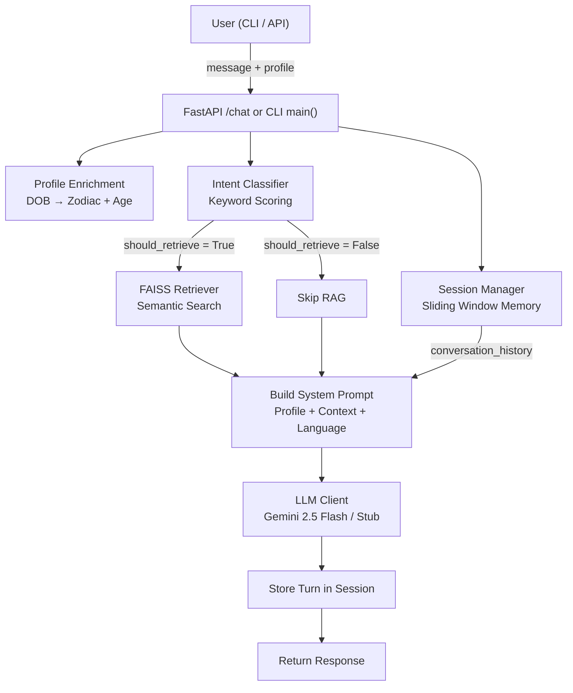
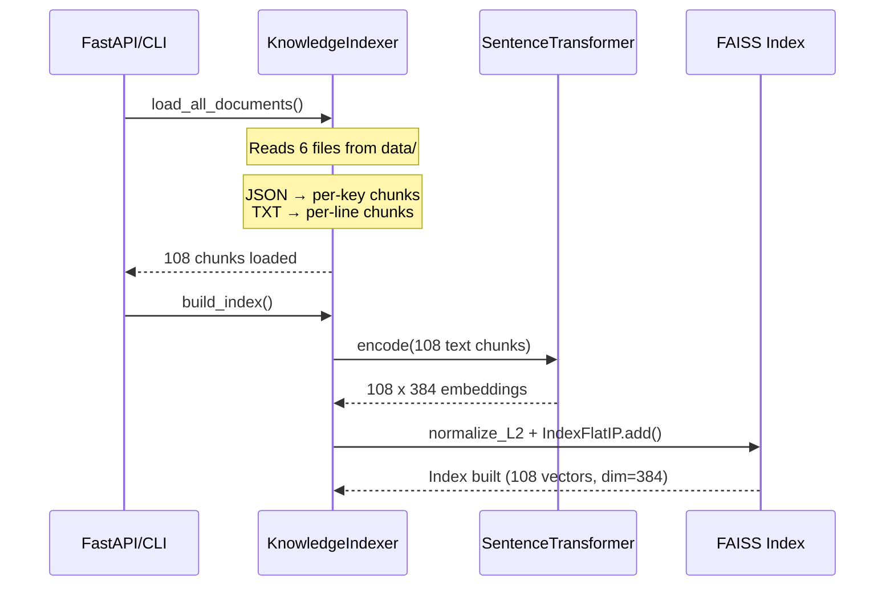
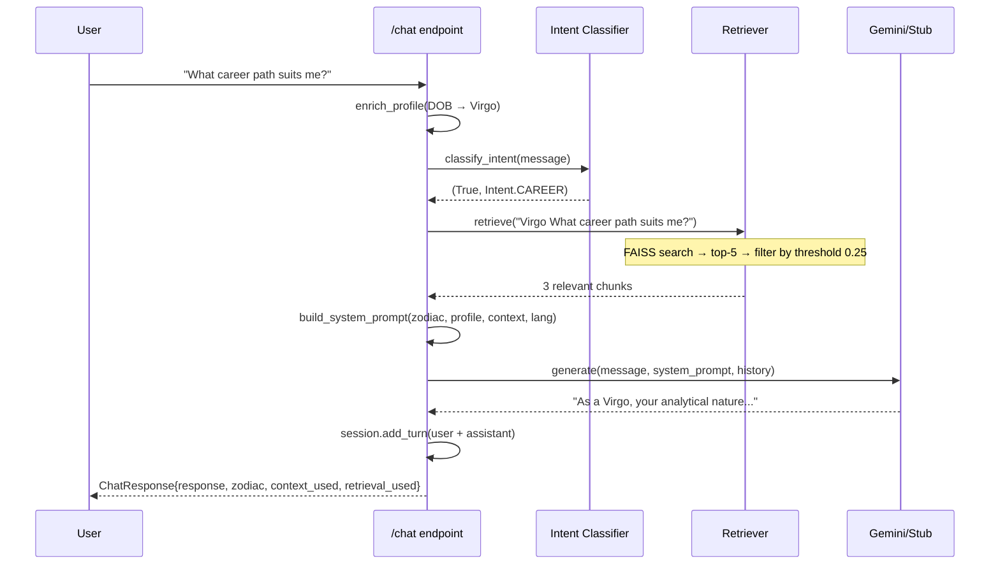
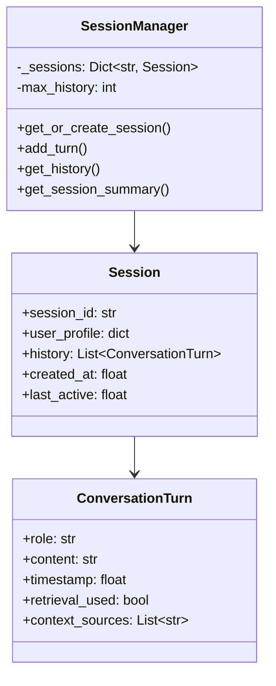
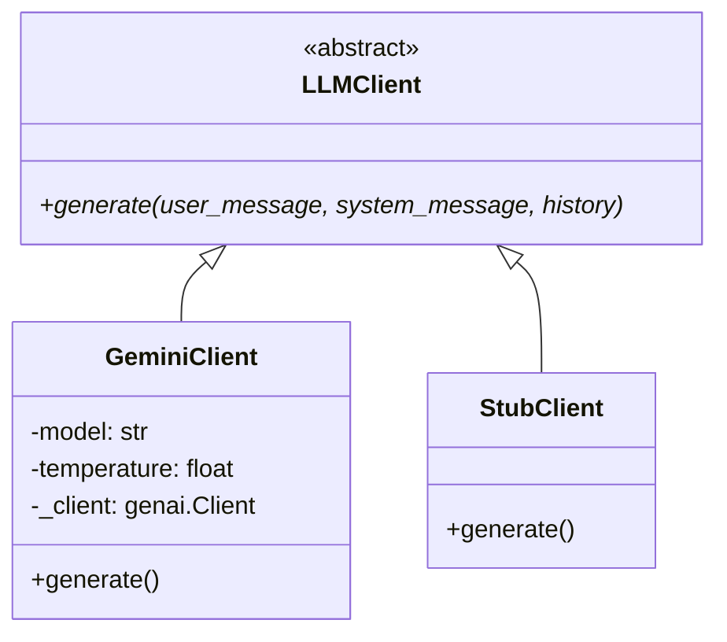

# 🔮 MyNaksh — Complete Code Walkthrough & Interview Guide

A detailed breakdown of how the **Astro Conversational Insight Agent** works, followed by **50+ interview questions** categorized by topic and difficulty.

---

## Table of Contents

1. [High-Level Architecture](#1-high-level-architecture)
2. [Data Flow — End-to-End Pipeline](#2-data-flow--end-to-end-pipeline)
3. [Module-by-Module Walkthrough](#3-module-by-module-walkthrough)
4. [Interview Questions](#4-interview-questions)

---

## 1. High-Level Architecture



The system follows a **7-step pipeline** for every user message:

| Step | Component | What Happens |
|------|-----------|-------------|
| 1 | Profile Enrichment | Derive zodiac sign from DOB |
| 2 | Session Management | Get/create session, load history |
| 3 | Intent Classification | Keyword-score to decide if RAG is needed |
| 4 | RAG Retrieval | Query FAISS with zodiac-enhanced query |
| 5 | Prompt Construction | Assemble system prompt with profile + context |
| 6 | LLM Generation | Call Gemini or return stub response |
| 7 | Memory Update | Append user + assistant turns, apply sliding window |

---

## 2. Data Flow — End-to-End Pipeline

### Startup (Indexing Phase)



**Key details:**
- **JSON files** (zodiac_traits, planetary_impacts, nakshatra_mapping) → each top-level key becomes one chunk. E.g., `"Aries"` with its personality/strengths/challenges is one chunk.
- **TXT files** (career_guidance, love_guidance, spiritual_guidance) → each line becomes one chunk. Each has ~20 lines.
- Total: **12 + 9 + 27 + 20 + 20 + 20 = 108 chunks**.
- Embedding model: `all-MiniLM-L6-v2` (384-dimensional, ~22M params).
- FAISS uses `IndexFlatIP` (Inner Product) on L2-normalized vectors = **cosine similarity**.

### Runtime (Query Phase)



---

## 3. Module-by-Module Walkthrough

---

### 3.1 — [models.py](file:///Users/cypherdious/Code/MyNaksh%20-%20Priyansh/app/models.py) (Pydantic Models)

Three simple Pydantic models define the API contract:

| Model | Purpose | Key Fields |
|-------|---------|-----------|
| [UserProfile](file:///Users/cypherdious/Code/MyNaksh%20-%20Priyansh/app/models.py#8-15) | Birth details + preferences | `name`, `birth_date`, `birth_time`, `birth_place`, `preferred_language` |
| [ChatRequest](file:///Users/cypherdious/Code/MyNaksh%20-%20Priyansh/app/models.py#17-22) | Incoming message | `session_id`, [message](file:///Users/cypherdious/Code/MyNaksh%20-%20Priyansh/cli.py#96-150), [user_profile](file:///Users/cypherdious/Code/MyNaksh%20-%20Priyansh/cli.py#63-94) |
| [ChatResponse](file:///Users/cypherdious/Code/MyNaksh%20-%20Priyansh/app/models.py#24-30) | Outgoing response | `response`, [zodiac](file:///Users/cypherdious/Code/MyNaksh%20-%20Priyansh/app/profile.py#26-48), `context_used`, `retrieval_used` |

**How it works:** `ChatRequest.user_profile` is a nested [UserProfile](file:///Users/cypherdious/Code/MyNaksh%20-%20Priyansh/app/models.py#8-15), so a single POST body contains both the message and the user identity. `context_used` returns which knowledge sources were retrieved (e.g., `["career_guidance", "zodiac_traits"]`), providing transparency into what powered the answer.

---

### 3.2 — [profile.py](file:///Users/cypherdious/Code/MyNaksh%20-%20Priyansh/app/profile.py) (Zodiac Derivation)

**Core logic — [get_zodiac_sign()](file:///Users/cypherdious/Code/MyNaksh%20-%20Priyansh/app/profile.py#26-48):**

```python
ZODIAC_DATES = [
    (1, 19, "Capricorn"),  # Jan 1–19
    (2, 18, "Aquarius"),   # Jan 20 – Feb 18
    ...
    (12, 31, "Capricorn"), # Dec 22–31 (wraps around)
]
```

It iterates through the list and returns the first sign where [(month, day) <= (end_month, end_day)](file:///Users/cypherdious/Code/MyNaksh%20-%20Priyansh/cli.py#152-211). The list is ordered so this works as a simple boundary scan. Capricorn appears twice to handle the year-end wrap.

**[enrich_profile()](file:///Users/cypherdious/Code/MyNaksh%20-%20Priyansh/app/profile.py#63-74)** takes the raw user dict, adds [zodiac](file:///Users/cypherdious/Code/MyNaksh%20-%20Priyansh/app/profile.py#26-48) and [age](file:///Users/cypherdious/Code/MyNaksh%20-%20Priyansh/app/profile.py#50-61), and returns an enriched copy. This is the only place DOB → zodiac conversion happens.

---

### 3.3 — [session.py](file:///Users/cypherdious/Code/MyNaksh%20-%20Priyansh/app/session.py) (Conversation Memory)

**Architecture:**



**Key mechanism — Sliding Window:**

```python
if len(session.history) > self.max_history:
    session.history = session.history[-self.max_history:]
```

After every [add_turn()](file:///Users/cypherdious/Code/MyNaksh%20-%20Priyansh/app/session.py#72-109), if history exceeds `max_history=10` turns, it slices to keep only the **last 10**. This bounds token usage in the LLM prompt while preserving recent context.

**[get_session_summary()](file:///Users/cypherdious/Code/MyNaksh%20-%20Priyansh/app/session.py#125-148)** collects all assistant turns and truncates each to 150 chars — used when the user asks "summarize what you've told me" to avoid an LLM call.

---

### 3.4 — [indexer.py](file:///Users/cypherdious/Code/MyNaksh%20-%20Priyansh/app/rag/indexer.py) (FAISS Index Builder)

**Chunking strategy:**

| File Type | Chunking | Example |
|-----------|----------|---------|
| JSON | One chunk per top-level key | `"Aries": {personality, strengths, challenges}` → 1 chunk |
| TXT | One chunk per non-empty line | `"Meditation can enhance inner balance..."` → 1 chunk |

**Index construction:**

```python
# 1. Encode all chunks
embeddings = model.encode(texts)   # shape: (108, 384)
# 2. Normalize for cosine similarity
faiss.normalize_L2(embeddings)
# 3. Build flat inner-product index
index = faiss.IndexFlatIP(384)
index.add(embeddings)
```

Using `IndexFlatIP` on L2-normalized vectors makes inner-product search equivalent to cosine similarity. This is an **exact search** (brute-force), which is fine for 108 vectors.

**Lazy model loading:** The `SentenceTransformer` is only loaded on first use via [_get_model()](file:///Users/cypherdious/Code/MyNaksh%20-%20Priyansh/app/rag/indexer.py#55-61), avoiding import-time overhead.

---

### 3.5 — [retriever.py](file:///Users/cypherdious/Code/MyNaksh%20-%20Priyansh/app/rag/retriever.py) (Semantic Search)

Wraps the indexer's raw FAISS search with:

1. **Similarity threshold** (`0.25`) — filters out low-relevance chunks
2. **Source tracking** — extracts deduplicated source file names for the API response
3. **Context formatting** — assembles a markdown-like string for the LLM prompt:

```
### Retrieved Astrological Knowledge:

[Source: zodiac_traits | Key: Virgo | Relevance: 0.72]
Virgo:
  personality: Analytical, detail-oriented...
  strengths: Attention to detail...
```

**Query enhancement** happens in [main.py](file:///Users/cypherdious/Code/MyNaksh%20-%20Priyansh/app/main.py): the zodiac sign is prepended to the user's query (`"Virgo What career path suits me?"`) to bias retrieval toward sign-relevant chunks.

---

### 3.6 — [intent.py](file:///Users/cypherdious/Code/MyNaksh%20-%20Priyansh/app/rag/intent.py) (Intent Classification)

**Purpose:** Decide whether to invoke the RAG retriever or skip it (saving compute + avoiding irrelevant chunks in the prompt).

**Mechanism — Keyword scoring:**

```python
for intent, keywords in INTENT_KEYWORDS.items():
    score = 0
    for keyword in keywords:
        if keyword in message_lower:
            score += 1
        if re.search(r'\b{keyword}\b', message_lower):  # exact word match bonus
            score += 1
```

| Intent | Retrieval? | Example Triggers |
|--------|-----------|------------------|
| CAREER | ✅ Yes | "career", "job", "salary", "promotion" |
| LOVE | ✅ Yes | "love", "relationship", "marriage" |
| SPIRITUAL | ✅ Yes | "meditation", "karma", "chakra" |
| PLANETARY | ✅ Yes | "saturn", "retrograde", "nakshatra" |
| ZODIAC_TRAITS | ✅ Yes | "zodiac", "personality", "virgo" |
| PREDICTION | ✅ Yes | "2026", "month", "horoscope" |
| GREETING | ❌ No | "hello", "namaste" |
| SUMMARY | ❌ No | "summarize", "what have you told me" |
| META | ❌ No | "who are you", "wrong answer" |
| GENERAL | ✅ Yes | *(no keywords matched — retrieve as fallback)* |

**Design choice:** Uses heuristics (not an LLM call) for classification to avoid wasting an API call on routing.

---

### 3.7 — [client.py](file:///Users/cypherdious/Code/MyNaksh%20-%20Priyansh/app/llm/client.py) (LLM Abstraction)

**Class hierarchy:**



**`GeminiClient.generate()`:**
1. Converts conversation history to Gemini's `Content` format (mapping `"assistant"` → `"model"`)
2. Appends the current user message
3. Calls `client.models.generate_content()` with `system_instruction`, `temperature=0.7`, `max_output_tokens=8192`

**`StubClient.generate()`:**
A deterministic fallback that parses the system prompt for zodiac info and retrieved context, then returns template-based responses. Supports both English and Hindi branches.

**[build_system_prompt()](file:///Users/cypherdious/Code/MyNaksh%20-%20Priyansh/app/llm/client.py#195-253):**
Assembles the system instruction string with:
- Persona: "expert Vedic and Western astrology advisor"
- User profile section (name, zodiac, DOB, birth time/place, age)
- Retrieved context block (if any)
- Hindi language instruction (if `preferred_language == "hi"`)
- Response guidelines (be specific, reference zodiac, 2–4 paragraphs)

**Factory pattern — [get_llm_client()](file:///Users/cypherdious/Code/MyNaksh%20-%20Priyansh/app/llm/client.py#255-267):**

```python
if os.getenv("GEMINI_API_KEY"):
    return GeminiClient()
else:
    return StubClient()
```

---

### 3.8 — [main.py](file:///Users/cypherdious/Code/MyNaksh%20-%20Priyansh/app/main.py) (FastAPI Application)

**Startup lifecycle ([lifespan](file:///Users/cypherdious/Code/MyNaksh%20-%20Priyansh/app/main.py#44-65)):**
- Builds the FAISS index from `data/` at server start
- Initializes the LLM client (Gemini or Stub)
- All components are stored as module-level globals

**`POST /chat` — The 8-step pipeline:**

| Step | Code | Purpose |
|------|------|---------|
| 1 | [enrich_profile()](file:///Users/cypherdious/Code/MyNaksh%20-%20Priyansh/app/profile.py#63-74) | DOB → Zodiac + Age |
| 2 | [classify_intent()](file:///Users/cypherdious/Code/MyNaksh%20-%20Priyansh/app/rag/intent.py#103-144) | Decide retrieval strategy |
| 3 | Handle SUMMARY intent | Return session summary without LLM |
| 4 | `retriever.retrieve()` | FAISS semantic search |
| 5 | [build_system_prompt()](file:///Users/cypherdious/Code/MyNaksh%20-%20Priyansh/app/llm/client.py#195-253) | Construct system instruction |
| 6 | `llm_client.generate()` | Get LLM response |
| 7 | `session_manager.add_turn()` | Persist both user + assistant turns |
| 8 | Return [ChatResponse](file:///Users/cypherdious/Code/MyNaksh%20-%20Priyansh/app/models.py#24-30) | Structured JSON with metadata |

**Special case — Summary intent:** If the intent classifier detects a summary request, it bypasses the entire RAG + LLM pipeline and returns a simple aggregation of past assistant turns. This is both a **cost optimization** and a **quality improvement** (RAG chunks would pollute a summary).

---

### 3.9 — [cli.py](file:///Users/cypherdious/Code/MyNaksh%20-%20Priyansh/cli.py) (Interactive CLI)

The CLI mirrors the FastAPI pipeline but adds:
1. **Interactive profile collection** — prompts for name, DOB, birth time, place, language
2. **Turn-based loop** — `[Turn N] You: ... → 🌟 Astro Guide: ...`
3. **Continue checkpoint** — `"Want to continue? (y/n)"` after each response
4. **Noise suppression** — redirects stdout during model loading, suppresses HuggingFace warnings

**Key implementation detail:** The actual processing logic in [handle_message()](file:///Users/cypherdious/Code/MyNaksh%20-%20Priyansh/cli.py#96-150) is nearly identical to [main.py](file:///Users/cypherdious/Code/MyNaksh%20-%20Priyansh/app/main.py)'s `/chat` handler, demonstrating the separation of concerns — the presentation layer (CLI vs API) is independent of the business logic.

---

## 4. Interview Questions

### 🟢 Beginner / Foundational (Warm-Up)

| # | Question | What It Tests |
|---|----------|--------------|
| 1 | What is RAG? Why does this project use it instead of fine-tuning? | Core RAG concepts |
| 2 | What are the 3 Pydantic models and what purpose does each serve? | API design, data validation |
| 3 | How is the user's zodiac sign derived from their date of birth? Walk through [get_zodiac_sign()](file:///Users/cypherdious/Code/MyNaksh%20-%20Priyansh/app/profile.py#26-48). | Basic algorithmic logic |
| 4 | What is FAISS? Why was `IndexFlatIP` chosen here? | Vector search fundamentals |
| 5 | What does `all-MiniLM-L6-v2` do? What are its key properties (dimension, speed, size)? | Embedding models |
| 6 | What is the purpose of the [SessionManager](file:///Users/cypherdious/Code/MyNaksh%20-%20Priyansh/app/session.py#28-148)? Why is it needed? | State management |
| 7 | What is a "sliding window" in the context of conversation memory? Why limit to 10 turns? | Token budgeting |
| 8 | Explain the difference between [GeminiClient](file:///Users/cypherdious/Code/MyNaksh%20-%20Priyansh/app/llm/client.py#47-102) and [StubClient](file:///Users/cypherdious/Code/MyNaksh%20-%20Priyansh/app/llm/client.py#104-193). Why have both? | Abstraction, testing |
| 9 | What is the purpose of the [system_prompt](file:///Users/cypherdious/Code/MyNaksh%20-%20Priyansh/app/llm/client.py#195-253) sent to the LLM? | Prompt engineering basics |
| 10 | Why are JSON files chunked per-key while TXT files are chunked per-line? | Chunking strategy |

---

### 🟡 Intermediate / Design Decisions

| # | Question | What It Tests |
|---|----------|--------------|
| 11 | Why does the intent classifier use **keyword scoring** instead of an LLM call? What are the trade-offs? | System design trade-offs |
| 12 | The query is enhanced with the zodiac sign before retrieval (`"Virgo What career path suits me?"`). Why? What could go wrong? | Retrieval relevance tuning |
| 13 | Explain why `faiss.normalize_L2()` is called before adding vectors to `IndexFlatIP`. What would happen without it? | Vector similarity math |
| 14 | The similarity threshold is `0.25`. How would you determine the optimal value in production? | Evaluation methodology |
| 15 | What happens when the intent is `SUMMARY`? Why is the LLM bypassed entirely? | Cost-aware design |
| 16 | The [StubClient](file:///Users/cypherdious/Code/MyNaksh%20-%20Priyansh/app/llm/client.py#104-193) parses the system prompt to extract zodiac information. Why is this an anti-pattern? How would you improve it? | Code smell detection |
| 17 | Why does the app use `asynccontextmanager` for the FAISS index lifecycle? | FastAPI lifecycle patterns |
| 18 | What is the Factory Method pattern? Where is it used in this codebase? | Design patterns |
| 19 | How does the system handle Hindi responses? Is it a code-level switch or LLM-level? | Multilingual LLM design |
| 20 | If two users share the same `session_id`, what happens? Is this a bug or a feature? | Session isolation |

---

### 🔴 Advanced / Deep-Dive

| # | Question | What It Tests |
|---|----------|--------------|
| 21 | The current approach uses **flat FAISS search** (brute-force). At what scale would this break? What alternatives would you use and why? | Scalability thinking |
| 22 | This uses **in-memory session storage**. Design a production-ready alternative. What database would you choose and why? | Systems architecture |
| 23 | How would you evaluate the quality of RAG retrieval? Propose specific metrics and a testing framework. | ML evaluation methodology |
| 24 | The intent classifier has no "multi-intent" handling. A user asks: *"Tell me about my career and love life"*. What happens? How would you fix it? | Edge case analysis |
| 25 | How would you add **guardrails** to prevent the LLM from generating harmful or factually incorrect astrological advice? | LLM safety, content moderation |
| 26 | The embeddings are generated once at startup. If you added new knowledge files dynamically, how would you handle incremental indexing? | System design — hot reloading |
| 27 | Why is `max_output_tokens=8192` set? What happens if the system prompt + history exceeds the model's context window? | Token limits, context management |
| 28 | How would you add **observability** to this system? What specific metrics would you track? | MLOps, monitoring |
| 29 | If you needed to support 10,000 concurrent users, which components would need to change and how? | Production scaling |
| 30 | How would you implement **A/B testing** between different retrieval strategies (e.g., threshold 0.25 vs 0.35, top-3 vs top-5)? | Experimentation infrastructure |

---

### 🟣 RAG-Specific Deep Questions

| # | Question | What It Tests |
|---|----------|--------------|
| 31 | What is the difference between **sparse retrieval** (BM25) and **dense retrieval** (FAISS)? When would you use each? | Information retrieval theory |
| 32 | This system uses a **single-stage retriever**. What is a **re-ranker** and how would adding one improve results? | Advanced RAG architecture |
| 33 | The current chunking splits JSON by top-level key. What if a zodiac entry had 2000 words? How would you handle it? | Chunking for long documents |
| 34 | What is **hybrid search**? How would you combine BM25 + FAISS in this system? | Hybrid retrieval |
| 35 | How would you handle **knowledge conflicts** — e.g., zodiac_traits says one thing about Aries but career_guidance contradicts it? | Knowledge consistency |
| 36 | What is **embedding drift**? If you updated the embedding model, what would break and how would you migrate? | Model versioning |
| 37 | Explain the concept of **retrieval-augmented reasoning**. How does this differ from simply dumping retrieved text into the prompt? | Advanced RAG patterns |
| 38 | How would you implement **source attribution** — showing the user exactly which sentence from which file influenced the LLM's answer? | Explainability in RAG |

---

### 🔵 LLM & Prompt Engineering

| # | Question | What It Tests |
|---|----------|--------------|
| 39 | Walk through [build_system_prompt()](file:///Users/cypherdious/Code/MyNaksh%20-%20Priyansh/app/llm/client.py#195-253). What are the key sections and why does their ordering matter? | Prompt engineering |
| 40 | The temperature is set to `0.7`. What does this control? When would you raise or lower it for astrology? | LLM generation parameters |
| 41 | How does the conversation history get passed to Gemini? Why is "assistant" mapped to "model"? | API-specific knowledge |
| 42 | What is **prompt injection**? Give an example attack on this system and how to defend against it. | LLM security |
| 43 | If the LLM starts hallucinating planetary positions, how would you detect and prevent this? | Hallucination mitigation |
| 44 | How would you fine-tune a model specifically for Vedic astrology? What data would you need? | Fine-tuning methodology |

---

### ⚫ System Design & Production Readiness

| # | Question | What It Tests |
|---|----------|--------------|
| 45 | The app uses module-level globals for `indexer`, `retriever`, and [llm_client](file:///Users/cypherdious/Code/MyNaksh%20-%20Priyansh/app/llm/client.py#255-267). What problems does this cause in production? How would you fix it? | Dependency injection, testing |
| 46 | How would you add **authentication** so only authorized users can access the API? | API security |
| 47 | How would you implement **rate limiting** per user to prevent API cost overruns? | Cost management |
| 48 | The current system has no caching. Where would caching help most? Design a caching strategy. | Performance optimization |
| 49 | How would you deploy this as a **microservice** on Kubernetes? What would the architecture look like? | Cloud deployment |
| 50 | How would you set up a **CI/CD pipeline** that validates RAG quality before deploying new knowledge files? | MLOps, CI/CD |

---

### 🧩 Scenario-Based / Behavioral

| # | Question | What It Tests |
|---|----------|--------------|
| 51 | A user reports: *"The bot gives the same answer for every career question."* How would you debug this? | Debugging methodology |
| 52 | The FAISS index takes 30 seconds to build at startup, causing cold-start latency. How would you optimize this? | Performance optimization |
| 53 | A user asks something in Hinglish (*"Mera career kaisa hoga?"*). The current system can't handle it. What would you change? | Multilingual NLP |
| 54 | You're asked to add **nakshatra-based predictions** using the user's birth time. The data exists in [nakshatra_mapping.json](file:///Users/cypherdious/Code/MyNaksh%20-%20Priyansh/data/nakshatra_mapping.json) but isn't used in the pipeline. Walk through exactly what you'd change. | Feature design exercise |
| 55 | The business wants to track which knowledge file drives the most engagement. How would you instrument this? | Analytics, data engineering |

---

## Quick-Reference: Answer Pointers

> [!TIP]
> For each question, here's a one-line pointer to where the answer lies in the code:

| Q# | Key File / Line | Core Concept |
|----|----------------|--------------|
| 3 | [profile.py:9–23](file:///Users/cypherdious/Code/MyNaksh%20-%20Priyansh/app/profile.py#L9-L23) | `ZODIAC_DATES` boundary-scan |
| 13 | [indexer.py:170](file:///Users/cypherdious/Code/MyNaksh%20-%20Priyansh/app/rag/indexer.py#L170) | `faiss.normalize_L2()` for cosine via IP |
| 15 | [main.py:115–130](file:///Users/cypherdious/Code/MyNaksh%20-%20Priyansh/app/main.py#L115-L130) | Summary intent bypasses LLM |
| 18 | [client.py:255–266](file:///Users/cypherdious/Code/MyNaksh%20-%20Priyansh/app/llm/client.py#L255-L266) | [get_llm_client()](file:///Users/cypherdious/Code/MyNaksh%20-%20Priyansh/app/llm/client.py#255-267) factory |
| 21 | [indexer.py:174](file:///Users/cypherdious/Code/MyNaksh%20-%20Priyansh/app/rag/indexer.py#L174) | `IndexFlatIP` = O(n) brute-force |
| 24 | [intent.py:134](file:///Users/cypherdious/Code/MyNaksh%20-%20Priyansh/app/rag/intent.py#L134) | `max()` picks single best intent |
| 40 | [client.py:50](file:///Users/cypherdious/Code/MyNaksh%20-%20Priyansh/app/llm/client.py#L50) | `temperature: float = 0.7` |
